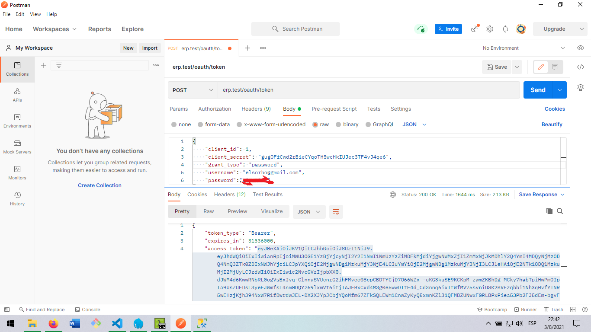
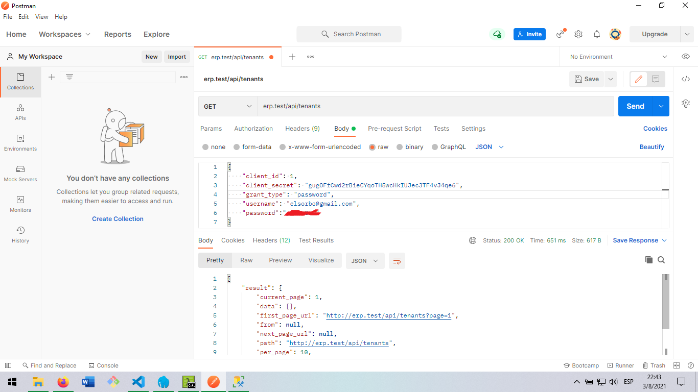
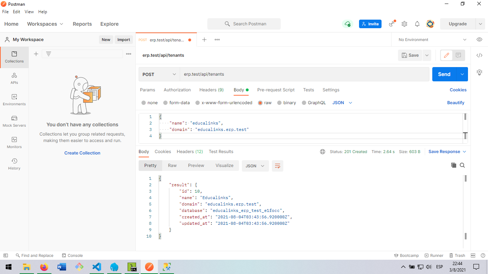
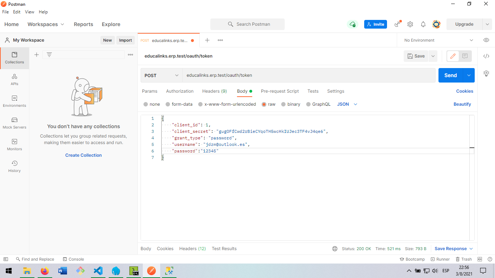
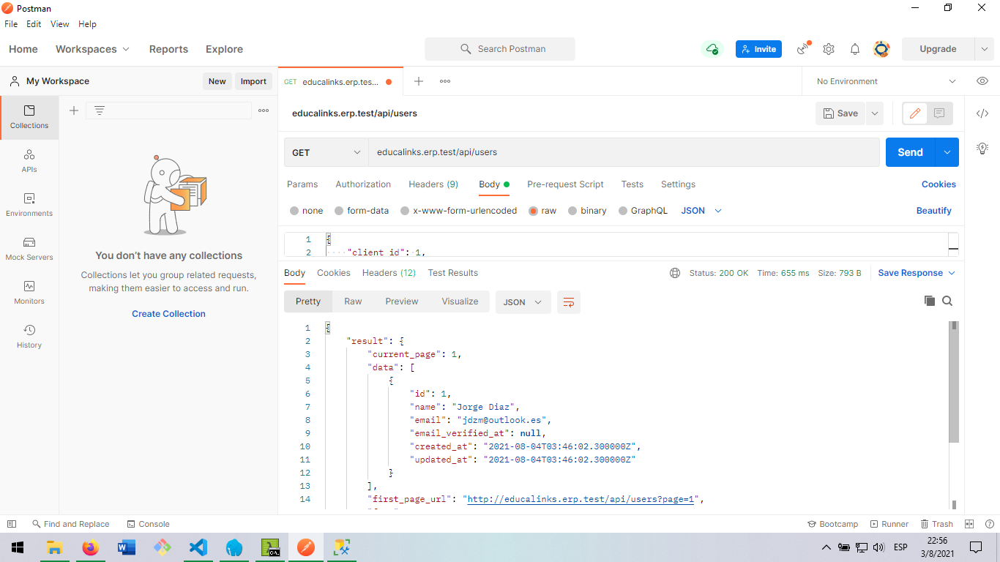
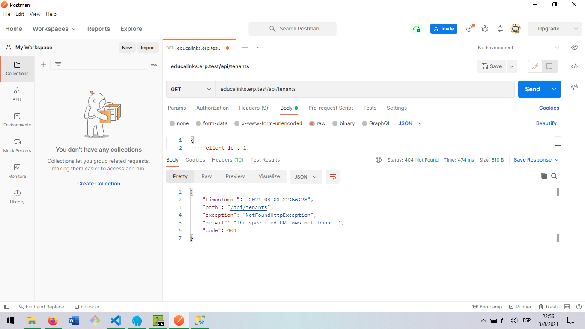

# Levantar aplicación

## Instalación de dependencias 
Ejecutar en la terminal el comando:

```sh
    composer install
```
Para instalar las dependencias necesarias.

## Ejecutar migraciones

Previo a esto se debe crear 2 base de datos, donde la base de datos ***landlord_db*** es donde guardaremos los inquilinos de nuestra aplicación y ***db_main*** es donde guardaremos al usuario y cliente principal o dueño de la aplicación. 

Es importante que el archivo *.env* tenga las siguientes variables:
```sh
DB_CONNECTION=tenant
DB_HOST=host
DB_PORT=
DB_DATABASE=
DB_USERNAME=
DB_PASSWORD=

DB_LAND=landlord_db

PASSPORT_PERSONAL_ACCESS_CLIENT_ID=
PASSPORT_PERSONAL_ACCESS_CLIENT_SECRET=
```

Como notaran, no necesitamos que la variable *DB_DATABASE* tenga el nombre de la base de datos, puesto que el cambio de base de datos es dinamico de acuerdo a la instancia de nuestra aplicación, pero es importante que DB_CONNECTION sea = *tenant*

Tambien observamos la aparación de 2 variables nuevas: *passport_personal_access_client_id*
*passport_personal_access_client_secret*

Que mas adelante veremos que valor tendrán.

Una vez preparado esto, ejecutamos:

```sh
    php artisan tenants:artisan migrate
```

Una vez ejecutadas las migraciones, necesitaremos generar unas llaves públicas y privadas necesarias para la autenticación con oauth2.

Esto lo podemos lograr ejecutando el comando de passport:
```sh
    php artisan passport:keys
```

Finalmente lo que debemos hacer es generar el secret client para nuestra aplicación, con el comando:

```sh
    php artisan passport:client --password
```

Esto nos generará el client Id y el client Secret que debemos colocar en las variables de entorno adicionales que agregamos en el **.env**

Posterior a esto podemos acceder a la vista **/register** y crear un usuario a manera de ejemplo con el formulario por defecto de laravel, y con las credenciales de ese usuario podemos efectuar una autenticación para obtener el token con el que podemos acceder a nuestros recursos protegidos.

## **Autenticando al usuario dueño de la aplicación**


Como se observa en la imagen se debe enviar el clientId y clientSecret junto con las credenciales del usuario de ese tenant principal para poder obtener el token.

## **Listando los inquilinos de nuestra aplicación con el usuario autenticado**


Cabe mencionar que se debe enviar el token generado en el Authorization de tipo Bearer token.

## **Creando un nuevo inquilino**


Al crear el inquilino se genera su propia base de datos, se realizan sus respectivas migraciones y se añade el clientId para que los usuarios de esa instancia puedan autenticarse.

## **Autenticando un usuario en el nuevo inquilino *educalinks***



## **Listando usuarios de ese inquilino***


Ojo que /api/users es una ruta protegida y se debe enviar el jwt token generado para el usuario de educalinks

## **Intentando acceder a los inquilinos existentes desde un inquilino***


**/api/tenants** a mas de ser una ruta protegida también es un recurso al cual no pueden acceder los inquilinos, pues es solo accesible para el dueño o landlord. Por lo tanto nos devuelve un error esperado en formato json con el detalle de lo acontecido.

## License

The Laravel framework is open-source software licensed under the [MIT license](https://opensource.org/licenses/MIT).